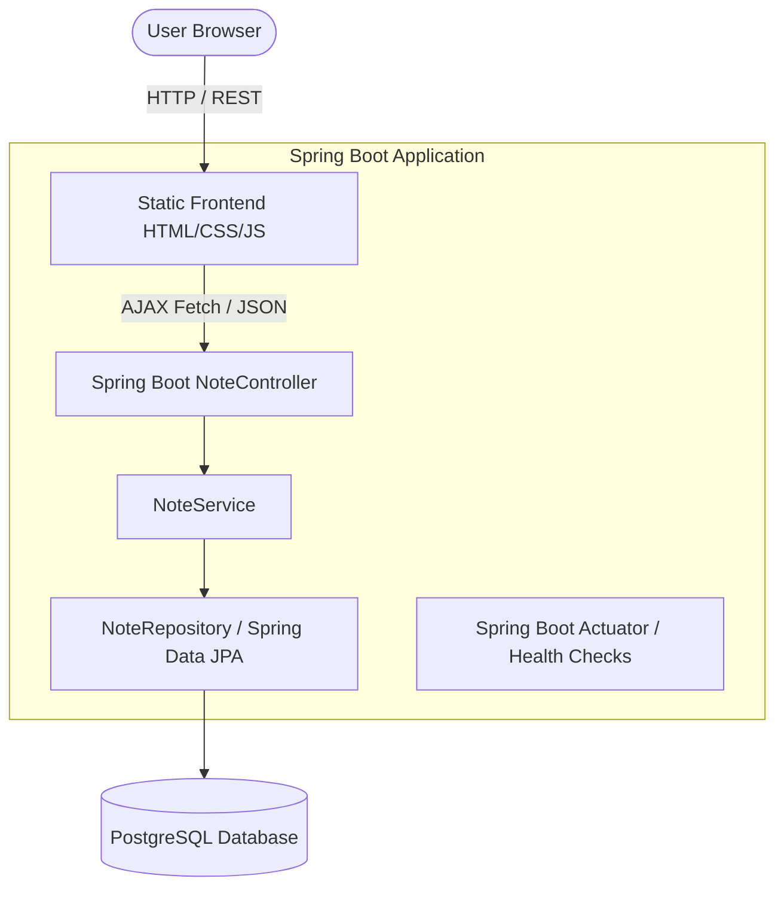
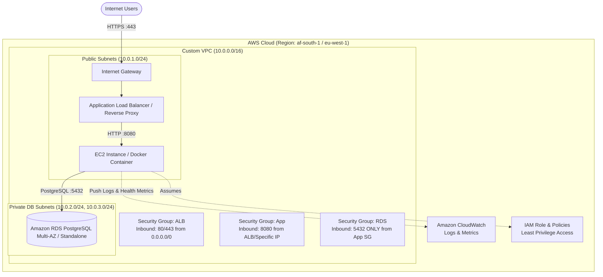

# CloudNotes Architecture & Design Specification

## 1. System Overview

**CloudNotes** is a lightweight, cloud-native notes application designed to demonstrate the complete lifecycle of a modern web application: from local development to cloud deployment, network isolation, managed databases, automated CI/CD, and observability.

The core philosophy of this project is simplicity in application logic combined with rigor in cloud engineering and DevOps best practices.

---

## 2. Architecture Diagrams

### 2.1 Logical Component Architecture (Local & Application Layer)



---

### 2.2 Target Cloud Infrastructure Architecture (AWS)



---

## 3. Technology Stack & Rationale

| Layer | Technology | Decision Rationale |
|---|---|---|
| **Language & Runtime** | Java 21 (LTS) | Modern LTS features: records, pattern matching, virtual threads capability, strong type safety. |
| **Framework** | Spring Boot 3.3+ | Robust REST APIs, built-in connection pooling (HikariCP), Spring Data JPA, Actuator for health probes. |
| **Database** | PostgreSQL 16+ | Industry standard relational database; local Docker matching AWS RDS engine. |
| **Frontend** | Vanilla HTML5 / CSS3 / Modern JS | Zero build step complexity; fast, responsive, and easy to package statically with the Spring Boot JAR. |
| **Containerization** | Docker | Consistent runtime environment locally, in CI, and on cloud compute instances. |
| **Cloud Provider** | AWS | Comprehensive ecosystem: VPC, EC2, RDS, IAM, CloudWatch. |
| **CI/CD** | GitHub Actions | Automated build, testing, Docker image packaging, and deployment pipeline. |
| **Infrastructure as Code (Future)** | Terraform | Declarative infrastructure provisioning ensuring reproducible cloud environments. |

---

## 4. API Specification

All API endpoints produce and consume `application/json`.

### Endpoints

| Method | Endpoint | Description | Request Body | Response Status |
|---|---|---|---|---|
| `GET` | `/api/notes` | List all notes (ordered by updated date desc) | None | `200 OK` |
| `GET` | `/api/notes/{id}` | Get note by ID | None | `200 OK` / `404 Not Found` |
| `POST` | `/api/notes` | Create a new note | `{"title": "...", "content": "..."}` | `201 Created` / `400 Bad Request` |
| `PUT` | `/api/notes/{id}` | Update existing note | `{"title": "...", "content": "..."}` | `200 OK` / `404 Not Found` |
| `DELETE` | `/api/notes/{id}` | Delete a note | None | `204 No Content` / `404 Not Found` |
| `GET` | `/actuator/health` | Application & DB health status | None | `200 OK` / `503 Service Unavailable` |

### Data Model

```json
{
  "id": 1,
  "title": "Meeting Notes",
  "content": "Discuss cloud deployment architecture and networking security.",
  "createdAt": "2026-10-07T10:00:00Z",
  "updatedAt": "2026-10-07T10:05:00Z"
}
```

---

## 5. Security & Networking Strategy

1. **Defense in Depth**:
   - The PostgreSQL database will reside strictly in a **private subnet** with **no public IP**.
   - The database security group will only permit inbound TCP traffic on port `5432` originating from the application security group.
2. **Secrets Management**:
   - Database credentials and environment-specific settings are never committed to version control.
   - Configured via environment variables (`SPRING_DATASOURCE_URL`, `SPRING_DATASOURCE_USERNAME`, `SPRING_DATASOURCE_PASSWORD`).
3. **Least Privilege IAM**:
   - The compute instance will use an IAM instance role with only the necessary policies (e.g., CloudWatch Agent log shipping).
