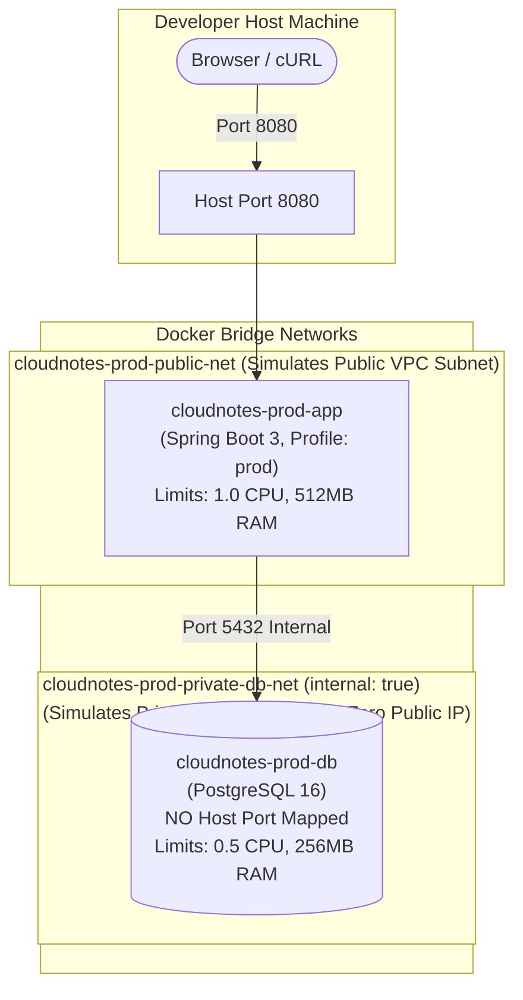

# 📦 CloudNotes Containerization & Local Production-Like Architecture

## 1. Overview

Phase 3 transitions **CloudNotes** into an immutable, containerized service ready for local testing and cloud compute platforms (AWS EC2 / ECS / EKS).

The container architecture consists of two primary tiers:
1. **Application Service (`app`)**: Spring Boot 3 running on Java 21 inside a security-hardened minimal Alpine container.
2. **Database Service (`postgres`)**: PostgreSQL 16 Alpine with persistent storage volumes and automated schema seeding.

---

## 2. Dockerfile Design & Security Hardening

The application is built and packaged using a multi-stage [Dockerfile](file:///c:/Users/KABELO%20PC/practise_projects/cloud-notes/Dockerfile):

```mermaid
graph LR
    subgraph Stage 1: Builder ["Stage 1: Builder (eclipse-temurin:21-jdk-alpine)"]
        POM[pom.xml & mvnw] --> Deps[Download Dependencies Offline]
        Src[src/ code] --> Pkg[Compile & Package JAR]
    end

    subgraph Stage 2: Runtime ["Stage 2: Runtime (eclipse-temurin:21-jre-alpine)"]
        NonRoot[Create non-root user 'cloudnotes:cloudnotes' UID 1001]
        CopyJar[Copy final app.jar]
        Health[Actuator Health Probe]
        Exec[exec java $JAVA_OPTS -jar app.jar (PID 1)]
    end

    Pkg --> CopyJar
```

### Key Production Engineering Highlights:
- **Layer Caching**: `pom.xml`, `.mvn`, and `mvnw` are copied first; `dependency:go-offline` caches all external Maven artifacts before application source code is copied. Code changes don't re-download dependencies.
- **Least Privilege (Non-Root)**: The runtime image creates an explicit unprivileged system user (`cloudnotes`, UID/GID `1001`). Processes never execute as `root`.
- **JVM Container Awareness**: Default JVM options (`-XX:+UseContainerSupport -XX:MaxRAMPercentage=75.0`) ensure the Java Virtual Machine dynamically queries cgroup memory/CPU limits rather than the host system's total physical capacity, preventing abrupt Out-Of-Memory (OOM) kills.
- **Graceful Shutdown & Signal Forwarding**: The entrypoint utilizes `exec java $JAVA_OPTS -jar app.jar "$@"` so that Java runs as **PID 1**, directly receiving `SIGTERM` and `SIGINT` signals from Docker and orchestrators for clean shutdown.
- **Automated Healthchecks**: Built-in container healthcheck queries `/actuator/health` with a `--start-period=20s` initialization buffer.

---

## 3. Orchestration Environments

Two distinct Docker Compose configurations are provided:

### 3.1 Local Development Environment (`docker-compose.yml`)

Designed for day-to-day developer productivity:
- Exposes port `8080` for the web UI and REST API.
- Exposes port `5432` to the host so developers can inspect data with tools like DBeaver, pgAdmin, or `psql`.
- Uses `SPRING_PROFILES_ACTIVE=local` with SQL logging enabled (`show-sql: true`).

```bash
# Start local development environment
docker compose up -d --build

# View logs
docker compose logs -f app

# Tear down
docker compose down
```

---

### 3.2 Local Production-Like Environment (`docker-compose.prod.yml`)

Designed to **faithfully reproduce the AWS Cloud architecture** locally before actual cloud provisioning:



#### Production Features:
1. **Network Isolation (Zero-Trust VPC Simulation)**:
   - `private-db-net` is configured with `internal: true`. Containers on this network have no default internet gateway or external routing.
   - The PostgreSQL container exposes **NO host ports**. It is strictly unreachable from the developer's host machine or external internet, mimicking an Amazon RDS instance situated in a private database subnet.
2. **Spring Production Profile (`prod`)**:
   - Connection pool managed by HikariCP with connection limits (`maximum-pool-size: 10`, `minimum-idle: 2`).
   - SQL debug logging disabled for performance.
3. **Hardware Resource Constraints**:
   - `app`: Capped at 1.0 CPU and 512MB RAM (simulating an EC2 `t3.micro` or AWS ECS Fargate 0.5 vCPU / 1GB container task).
   - `postgres-db`: Capped at 0.5 CPU and 256MB RAM.
4. **Automated Schema Initialization**:
   - Fresh database volumes automatically execute `docker/init-db/01-init.sql`, provisioning required tables, indexes (`idx_notes_updated_at`), and sample welcome notes.

```bash
# Start production-like stack
docker compose -f docker-compose.prod.yml up -d --build

# Check running status and resource limits
docker compose -f docker-compose.prod.yml ps

# Inspect logs
docker compose -f docker-compose.prod.yml logs -f app

# Tear down and clean up volumes
docker compose -f docker-compose.prod.yml down -v
```

---

## 4. Configuration Management (`.env`)

All parameters are externalized in [.env](file:///c:/Users/KABELO%20PC/practise_projects/cloud-notes/.env) (with template in [.env.example](file:///c:/Users/KABELO%20PC/practise_projects/cloud-notes/.env.example)):

| Variable | Default Value | Description |
|---|---|---|
| `APP_PORT` | `8080` | Host port mapped to Spring Boot application |
| `SPRING_PROFILES_ACTIVE` | `local` / `prod` | Active Spring profile |
| `DB_HOST` | `postgres` / `postgres-db` | Database hostname inside the container network |
| `DB_PORT` | `5432` | PostgreSQL internal port |
| `DB_NAME` | `cloudnotes` | PostgreSQL database name |
| `DB_USER` | `cloudnotes` | PostgreSQL username |
| `DB_PASSWORD` | `cloudnotes_secret` | PostgreSQL user password |
| `JAVA_OPTS` | `-XX:+UseContainerSupport...` | JVM options passed to container entrypoint |

---

## 5. Verification & Health Probes

Once containers are active:
- **Application UI**: `http://localhost:8080`
- **Actuator Health Check**: `http://localhost:8080/actuator/health`
  ```json
  {
    "status": "UP",
    "components": {
      "db": {
        "status": "UP",
        "details": {
          "database": "PostgreSQL",
          "validationQuery": "isValid()"
        }
      },
      "diskSpace": {
        "status": "UP"
      },
      "ping": {
        "status": "UP"
      }
    }
  }
  ```
- **REST API Probes**:
  ```bash
  # Fetch all notes
  curl -i http://localhost:8080/api/notes

  # Create a new note
  curl -i -X POST http://localhost:8080/api/notes \
    -H "Content-Type: application/json" \
    -d '{"title":"Docker Test Note","content":"Testing containerized PostgreSQL connectivity"}'
  ```
